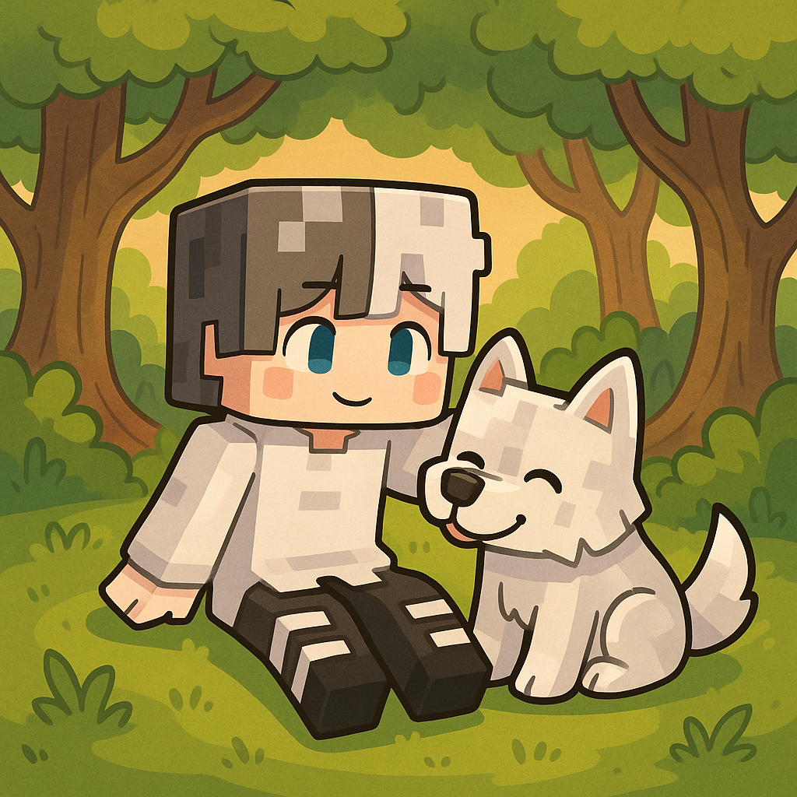

<!-- サイト中央の少し上にタイトルと説明を表示 -->
<!-- サイト左上にロゴ画像を表示 -->

  <h1>ゆるっとクラフトサーバー公式Wiki</h1>
  
最新情報・ルール・参加方法などをまとめたWikiです。

  <a href="serverjoin/" class="mc-btn">サーバーの入り方はこちら！</a>
  <a href="zahyou.md" class="mc-btn">座標共有※準備中</a>
  <a href="news/" class="mc-btn">最新のお知らせ・アップデート情報</a>
  <a href="https://discord.gg/4GgzbfV8fm" class="mc-btn" target="_blank" rel="noopener">Discordに参加</a>

<!-- 背景動画を表示（preload="none"で初回負荷軽減） -->
<video id="bgVideo" class="bg-video" src="background.mp4" autoplay loop muted playsinline preload="none"></video>

<!-- BGM自動再生・ON/OFFボタン（全ページ共通UI用） -->
<audio id="bgm" autoplay loop style="display:none;">
  <source src="bgm.mp3" type="audio/mpeg">
</audio>
<button id="bgm-toggle" class="mc-btn" style="position: fixed; top: 80px; right: 40px; z-index: 1000;">BGM OFF</button>
